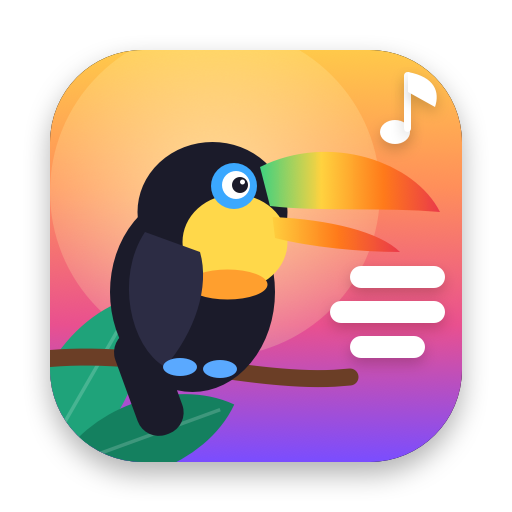
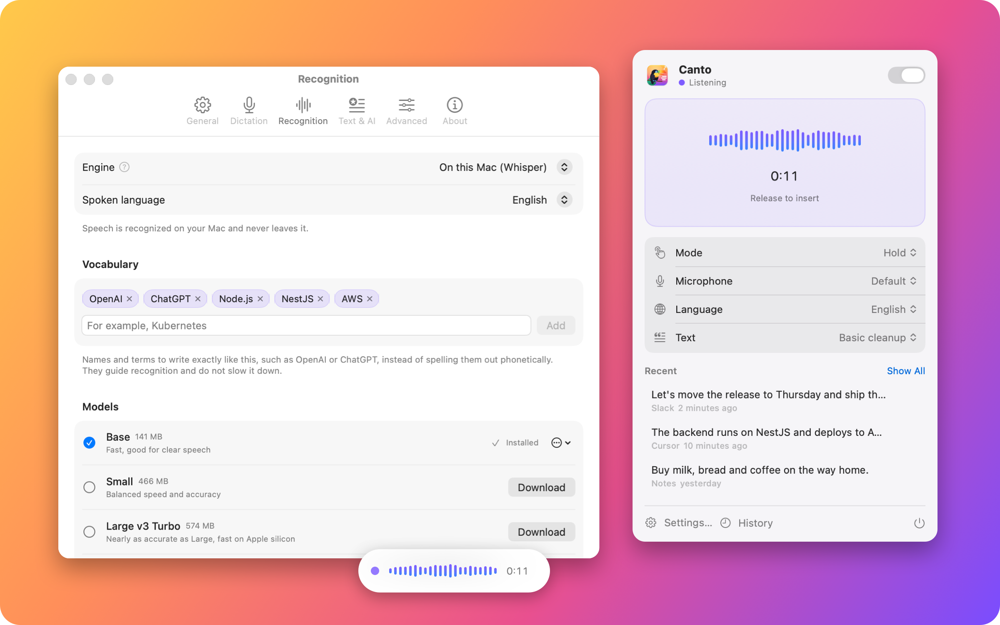
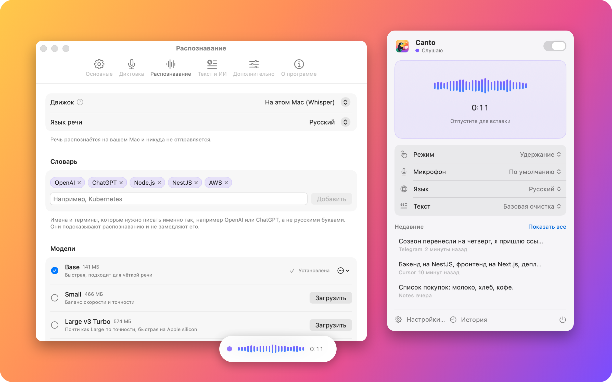

<p align="center">
  
</p>

<h1 align="center">Canto</h1>

<p align="center">
  <b>Dictate into any app on your Mac.</b><br>
  Hold a key, speak, and the text appears where your cursor is.
</p>

<p align="center">
  
  
  
</p>

<p align="center">
  On Windows or Linux? Try <a href="https://github.com/WtekSupport/veyro"><b>Veyro</b></a>, a cross-platform dictation app made by my friend.
</p>

<p align="center">
  <a href="#русский">Русский</a>
</p>

<p align="center">
  
</p>

Canto is a native menu bar app for voice typing. It records while you hold a shortcut, recognizes speech
on your Mac with [whisper.cpp](https://github.com/ggml-org/whisper.cpp) (or with OpenAI, if you prefer),
cleans the text up and pastes it into whatever you are working in: chats, email, notes, code editors, the terminal.

## Features

- **Works everywhere.** A global shortcut, or Caps Lock, in any app. Hold to talk, or press to start and stop
  and let pauses split your speech into phrases.
- **Private by default.** Speech is recognized on device with Whisper models accelerated by Metal. Nothing leaves
  your Mac unless you choose OpenAI.
- **OpenAI when you want it.** GPT-4o Transcribe or Whisper in the cloud, with an automatic fallback to a downloaded
  local model when the network does not answer.
- **Clean text.** Five modes: the original transcript, basic cleanup, and three AI modes that remove filler words,
  organize long thoughts into sections or format them as Markdown. Add your own AI styles as Markdown files.
- **Vocabulary.** Terms like OpenAI, Node.js or AWS are spelled the way you write them.
- **Small touches.** Spoken punctuation ("comma", "new paragraph"), numbers as words, a phrase that presses Return,
  a recording overlay, history, microphone selection, English and Russian interface.

## Requirements

- macOS 14 Sonoma or later. The app is built as a universal binary for Apple silicon and Intel; Apple silicon is
  recommended for local recognition.
- To build: Xcode 16 or later (developed with Xcode 26) and CMake (`brew install cmake`).

## Build and install

```bash
git clone https://github.com/jehkinen/canto.git
cd canto
scripts/build-app.sh   # downloads and builds whisper.cpp on first run, then builds build/Canto.app
scripts/install.sh     # copies Canto to /Applications and opens it
```

On first launch Canto walks you through the setup:

1. Allow **Microphone** access.
2. Allow **Accessibility** access, which Canto needs to paste text into other apps.
3. Download a speech model in Settings → Recognition. **Base** (141 MB) is the fastest; larger models such as
   **Large v3 Turbo** (574 MB) are more accurate but slower. Or choose OpenAI and add your API key.

### Signing

`build-app.sh` signs the app ad hoc. macOS ties the Accessibility permission to the signature, so after each
rebuild remove Canto from System Settings → Privacy & Security → Accessibility and allow it again. To keep the
permission across builds, create a self-signed certificate once: Keychain Access → Certificate Assistant →
Create a Certificate, name it `Canto Local Signing`, identity type *Self Signed Root*, certificate type
*Code Signing*. The build script uses it automatically, or set `SIGN_IDENTITY`.

## Privacy

- With on-device recognition, audio and text stay on your Mac.
- With OpenAI recognition or an AI text mode, the audio or the transcript is sent to OpenAI.
- The OpenAI API key is stored in the macOS Keychain. History is a local file you can turn off or clear.

## Development

| Path | Contents |
|---|---|
| `Canto/` | The app: SwiftUI menu bar panel, settings, history, first-run guide; services for audio capture, the global shortcut, text insertion, permissions and Keychain |
| `Packages/CantoKit` | Platform-independent logic with tests: settings, voice activity detection, audio preprocessing, text cleanup, AI rewriting, vocabulary, OpenAI clients, history |
| `Packages/WhisperBridge` | whisper.cpp as a universal static library with embedded Metal shaders, and a Swift wrapper |
| `Tools/Snapshots` | Renders every window to PNG without launching the app |
| `scripts/` | Build, install, icon, strings and README image scripts |

```bash
cd Packages/CantoKit && swift test                         # unit tests
cd Packages/WhisperBridge && swift run -c release \
  whisper-smoke model.bin speech-16k-mono.wav en           # recognition from the command line
Tools/Snapshots/render.sh /tmp/canto-ui en                 # UI screenshots
```

Open `Canto.xcodeproj` in Xcode after running `scripts/build-whisper.sh` once.

## Acknowledgements

- [whisper.cpp](https://github.com/ggml-org/whisper.cpp) by Georgi Gerganov and contributors (MIT)
- [libfvad](https://github.com/dpirch/libfvad), the WebRTC voice activity detector (BSD 3-Clause), included in
  `Packages/CantoKit/Sources/CFvad`

## License

Canto is available under the [MIT license](LICENSE).

---

<a id="русский"></a>

## Русский

<p align="center">
  
</p>

**Canto** — приложение для голосового ввода на Mac. Удерживайте клавишу, говорите, и текст появится там, где стоит
курсор: в мессенджере, почте, заметках, редакторе кода или терминале.

### Возможности

- **Работает в любом приложении.** Глобальное сочетание клавиш или Caps Lock. Режим «удерживать» или «нажать — старт
  и стоп», когда паузы сами делят речь на фразы.
- **Приватно по умолчанию.** Речь распознаётся на самом Mac моделями Whisper с ускорением Metal и никуда не
  отправляется, если вы не выбрали OpenAI.
- **OpenAI по желанию.** GPT-4o Transcribe или Whisper в облаке. Если сеть не отвечает, Canto распознаёт скачанной
  локальной моделью.
- **Чистый текст.** Пять режимов: исходный текст, базовая очистка и три ИИ-режима. Они убирают слова-паразиты,
  раскладывают длинные мысли по разделам или оформляют их в Markdown. Можно добавить свои стили в виде Markdown-файлов.
- **Словарь.** Термины вроде OpenAI, Node.js или AWS пишутся так, как вы их задали, а не русскими буквами.
- **Мелочи.** Произносимая пунктуация («запятая», «новый абзац»), числа прописью, фраза для нажатия Return, индикатор
  записи, история, выбор микрофона, интерфейс на русском и английском.

### Установка

Нужны macOS 14 или новее, Xcode 16+ и CMake (`brew install cmake`).

```bash
git clone https://github.com/jehkinen/canto.git
cd canto
scripts/build-app.sh   # при первом запуске скачает и соберёт whisper.cpp, затем соберёт build/Canto.app
scripts/install.sh     # скопирует Canto в «Программы» и откроет
```

При первом запуске Canto поможет:

1. Разрешить доступ к **микрофону**.
2. Разрешить **Универсальный доступ**: без него Canto не сможет вставлять текст в другие приложения.
3. Загрузить модель в «Настройки» → «Распознавание». **Base** (141 МБ) самая быстрая, модели крупнее, например
   **Large v3 Turbo** (574 МБ), точнее, но медленнее. Или выберите OpenAI и добавьте ключ API.

Сборка подписывается без сертификата, поэтому после каждой пересборки Универсальный доступ нужно выдать заново:
удалить Canto из списка кнопкой «−» и добавить снова. Чтобы разрешение сохранялось, один раз создайте в «Связке
ключей» самоподписанный сертификат для подписи кода с именем `Canto Local Signing`: скрипт сборки подхватит его сам.

### Приватность

- При локальном распознавании звук и текст остаются на вашем Mac.
- При распознавании через OpenAI или в ИИ-режимах звук или текст отправляются в OpenAI.
- Ключ API хранится в Связке ключей macOS. История — локальный файл, её можно отключить или очистить.

Лицензия — [MIT](LICENSE).
